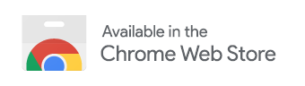

# Skip Button Clicker for YouTube™

Chrome extension that clicks the skip buttons on skippable advertisements on YouTube™

> YouTube is a trademark of Google LLC. Use of this trademark is subject to Google Permissions

## Installation

### Chrome Web Store

### Manual Installation

1. Download and unzip [Skip Button Clicker for YouTube™](https://github.com/yehwankim23/skip-button-clicker-for-youtube/releases/latest/download/skip-button-clicker-for-youtube.zip)
2. Go to Chrome Extensions tab (`chrome://extensions`) and enable `Developer mode`
3. Click `Load unpacked` and select the unzipped folder
